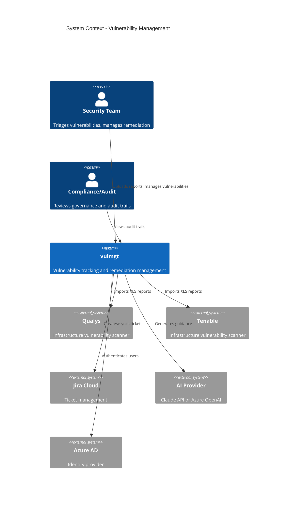
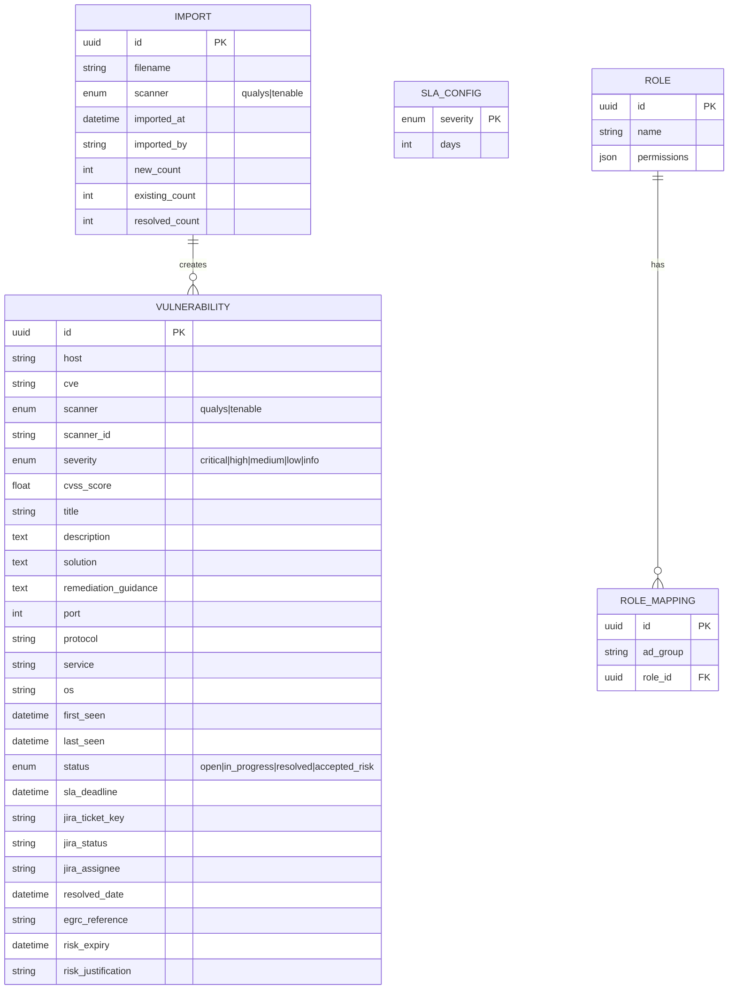
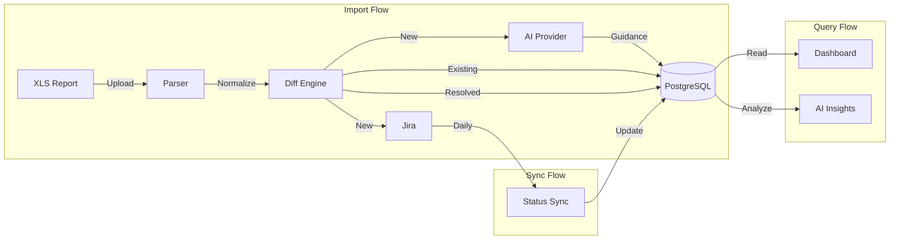
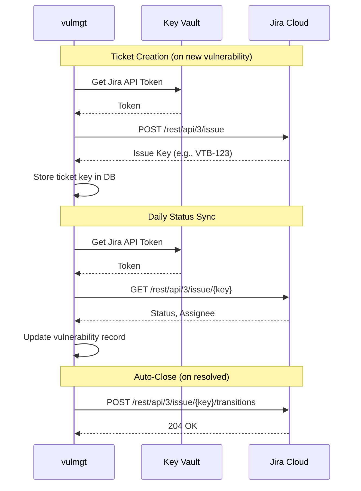
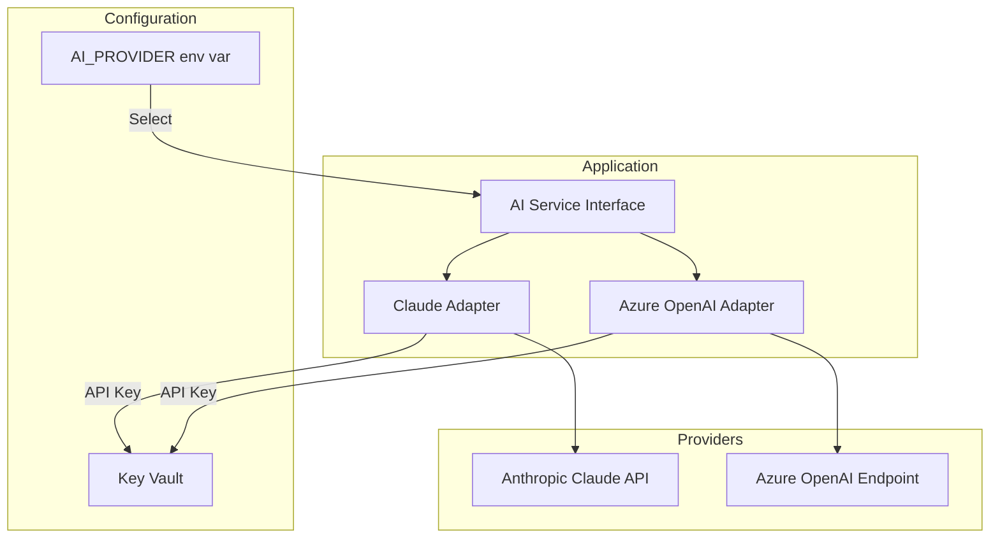
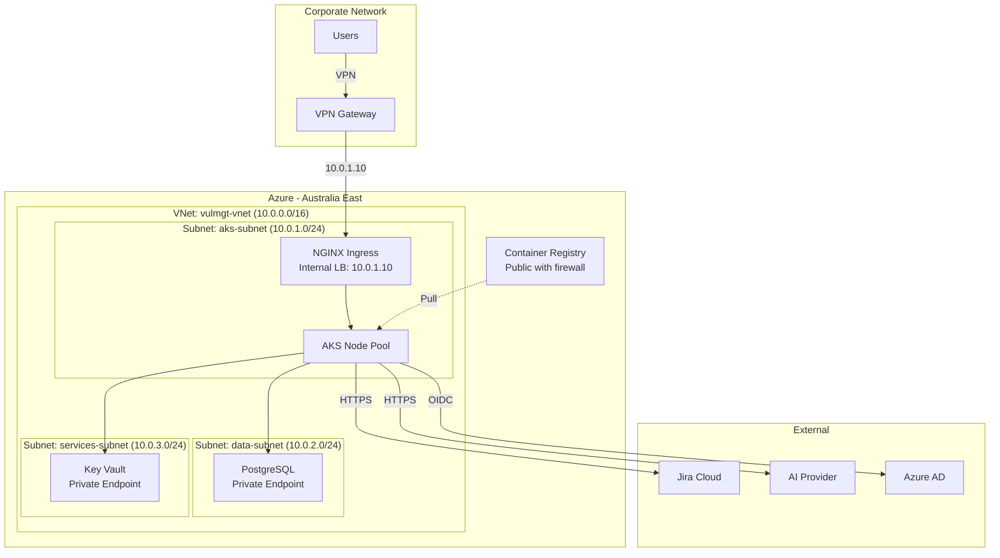
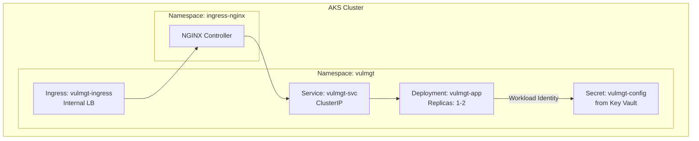
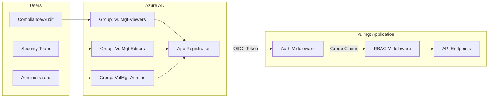
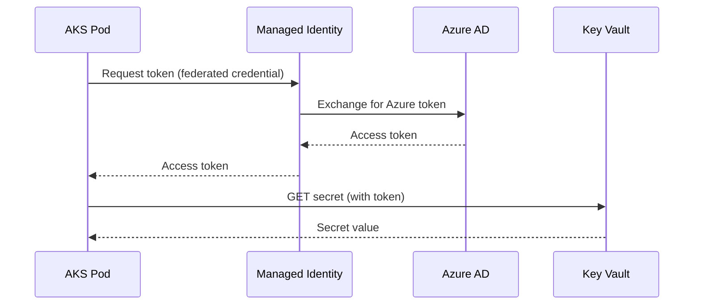
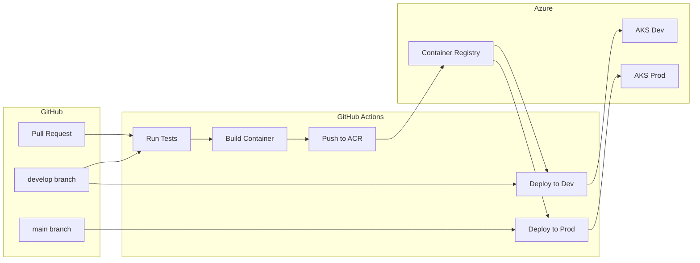

# Vulnerability Management (vulmgt) - Solution Architecture

**Version:** 2026-01-24
**Status:** Draft
**Owner:** Security Team
**Requirements:** [docs/requirements/2026-01-24-vulmgt-requirements.md](../requirements/2026-01-24-vulmgt-requirements.md)

## Version History

| Version | Date | Author | Changes |
|---------|------|--------|---------|
| 2026-01-24 | 2026-01-24 | Security Team | Initial draft |

---

## Executive Summary

The Vulnerability Management (vulmgt) solution is an internal web application that automates vulnerability tracking from scanner report ingestion through remediation completion. Built on Azure Kubernetes Service (AKS) with a PostgreSQL database, the application integrates with Qualys and Tenable scanners, Jira for ticket management, and configurable AI providers (Anthropic Claude or Azure OpenAI) for AI-powered remediation guidance.

**Key Architectural Decisions:**
- **Compute:** AKS with Azure CNI networking for enterprise VNet integration
- **Database:** Azure Database for PostgreSQL Flexible Server for managed, scalable storage
- **Authentication:** Azure AD SSO with group-based RBAC
- **Secrets:** Azure Key Vault with workload identity (no stored credentials)
- **Access:** Internal-only via corporate network/VPN
- **CI/CD:** GitHub Actions deploying to Azure Container Registry and AKS

**Target State:** A containerized Python/FastAPI application running in AKS, accessible to the Security Team for vulnerability management and Compliance/Audit for governance oversight. The solution prioritizes simplicity and maintainability over high availability, with Dev and Production environments in Australia East.

---

## Business Drivers & Constraints

### Business Drivers

| Driver | Description |
|--------|-------------|
| Operational Efficiency | Automate manual vulnerability tracking and Jira ticket creation |
| SLA Compliance | Enforce remediation deadlines with visibility and escalation warnings |
| Governance | Maintain audit trail of imports and risk acceptance decisions |
| Actionable Insights | AI-generated remediation guidance reduces research time |
| Pattern Detection | Identify systemic security issues across the vulnerability estate |

### Constraints

| Constraint | Impact |
|------------|--------|
| Internal Access Only | Must be deployed within corporate network, accessible via VPN |
| Best Effort Availability | No HA requirement; single-region, single-instance acceptable |
| Azure Platform | Must use Azure services (AKS, PostgreSQL, Key Vault) |
| Existing Integrations | Must integrate with Jira Cloud and existing Qualys/Tenable scanners |
| Team Size | Small team; prefer managed services over self-managed infrastructure |
| Budget | Cost-conscious; use burstable/consumption tiers where appropriate |

### Compliance Requirements

| Requirement | Implementation |
|-------------|----------------|
| Data Retention | 2-3 years for vulnerability and audit data |
| Access Control | Azure AD SSO with role-based access (Viewer, Editor, Admin) |
| Audit Trail | Import history and risk acceptance logged with timestamps |
| Secrets Management | No credentials in code; all secrets in Key Vault |

---

## Solution Overview

### What the System Does

The vulmgt application provides end-to-end vulnerability lifecycle management:

1. **Import** - Ingest weekly XLS reports from Qualys and Tenable scanners
2. **Track** - Deduplicate, track status, and calculate SLA deadlines
3. **Enrich** - Generate AI-powered remediation guidance via configurable AI provider
4. **Integrate** - Create and sync Jira tickets for remediation workflow
5. **Monitor** - Dashboard with SLA warnings, escalation alerts, and insights
6. **Govern** - Risk acceptance workflow with EGRC tracking

### Key Capabilities

| Capability | Description |
|------------|-------------|
| Multi-Scanner Support | Parse Qualys and Tenable XLS formats with extensible architecture |
| Intelligent Deduplication | Match by (host, CVE) to track vulnerability lifecycle |
| Automated Ticketing | Create Jira tickets with severity-mapped priority and due dates |
| Bidirectional Sync | Pull Jira status and assignee back to app daily |
| SLA Enforcement | Calculate deadlines, highlight approaching/overdue items |
| AI Remediation | AI-generated fix steps with OS-specific commands |
| AI Insights | Pattern analysis for systemic issues and training opportunities |
| Risk Acceptance | Document accepted risks with EGRC references and expiry dates |

### Scope Boundaries

**In Scope:**
- Vulnerability tracking and lifecycle management
- Jira integration for ticketing
- AI-assisted remediation and insights
- SLA tracking and escalation visibility
- Risk acceptance governance

**Out of Scope:**
- Vulnerability scanning (uses existing Qualys/Tenable)
- Automated remediation/patching
- Real-time scanner integration
- Multi-tenancy

### Solution Component Diagram

```mermaid
flowchart TB
    subgraph "Users"
        SEC[Security Team]
        AUD[Compliance/Audit]
    end

    subgraph "Azure - Australia East"
        subgraph "AKS Cluster"
            subgraph "vulmgt Application"
                FE[Web Dashboard<br/>HTML/Tailwind/JS]
                API[FastAPI Backend]
                IMP[Import Service]
                JIRA_SVC[Jira Client]
                AI_SVC[AI Client]
                SLA_SVC[SLA Service]
            end
            ING[NGINX Ingress<br/>Internal LB]
        end

        PG[(PostgreSQL<br/>Flexible Server)]
        KV[Key Vault]
        ACR[Container Registry]
    end

    subgraph "External Services"
        JIRA[Jira Cloud]
        AI[AI Provider<br/>Claude / Azure OpenAI]
        AAD[Azure AD]
    end

    subgraph "Data Sources"
        QUALYS[Qualys XLS Reports]
        TENABLE[Tenable XLS Reports]
    end

    SEC -->|VPN| ING
    AUD -->|VPN| ING
    ING --> FE
    FE --> API
    API --> IMP
    API --> JIRA_SVC
    API --> AI_SVC
    API --> SLA_SVC

    IMP -->|Parse| QUALYS
    IMP -->|Parse| TENABLE

    API --> PG
    API -->|Managed Identity| KV
    JIRA_SVC --> JIRA
    AI_SVC --> AI
    ING -->|SSO| AAD

    ACR -.->|Pull Image| AKS Cluster
```

---

## Architecture Principles

| Principle | Rationale | Implications |
|-----------|-----------|--------------|
| **Cloud-Native** | Leverage Azure managed services for reduced operational overhead | Use PaaS (PostgreSQL Flexible Server, Key Vault) over IaaS; containerize with AKS |
| **Simplicity First** | Small team, best-effort availability | Single region, minimal components, avoid over-engineering |
| **Secure by Default** | Security application handling sensitive vulnerability data | No secrets in code, private endpoints, SSO enforced, RBAC on all operations |
| **Graceful Degradation** | AI services are valuable but optional | System must function if AI provider unavailable; core workflow unaffected |
| **Extensibility** | Future scanner types (SAST/DAST) anticipated | Parser architecture supports new formats without major refactoring |
| **Managed Secrets** | No credentials stored in application or config files | All secrets in Key Vault, accessed via workload identity |
| **Infrastructure as Code** | Reproducible, auditable deployments | All Azure resources defined in Bicep/Terraform; GitHub Actions for CI/CD |
| **Minimal Privileges** | Reduce blast radius of potential compromise | Workload identity scoped to specific Key Vault secrets; RBAC least privilege |

---

## System Context

### External Actors and Systems

| Actor/System | Type | Interaction |
|--------------|------|-------------|
| Security Team | User | Upload reports, triage vulnerabilities, accept risk, view insights |
| Compliance/Audit | User | View import history, risk acceptance records, vulnerability status |
| Qualys | Data Source | Weekly XLS vulnerability scan reports (manual upload) |
| Tenable | Data Source | Weekly XLS vulnerability scan reports (manual upload) |
| Jira Cloud | Integration | Create tickets, sync status, close resolved tickets |
| AI Provider | Integration | Generate remediation guidance and pattern insights |
| Azure AD | Identity | SSO authentication, group-based role assignment |

### AI Provider Abstraction

| Provider | Endpoint | Notes |
|----------|----------|-------|
| Anthropic Claude | External API | Current implementation |
| Azure OpenAI | Azure tenant | GPT-4, GPT-4o, or other deployed models |
| Other LLM | Configurable | Any OpenAI-compatible API |

**Design:** The AI client will be abstracted behind a common interface, with the provider configurable via environment variable. Credentials stored in Key Vault regardless of provider.

### Context Diagram



### Trust Boundaries

| Boundary | Description |
|----------|-------------|
| Corporate Network | Users access via VPN; no public internet exposure |
| Azure VNet | AKS and PostgreSQL in private network; Key Vault via private endpoint |
| External APIs | Jira and AI provider accessed over HTTPS with credentials in Key Vault |

---

## Data Architecture

### Data Model



### Data Flows



### Data Storage

| Data | Storage | Retention | Backup |
|------|---------|-----------|--------|
| Vulnerabilities | PostgreSQL | 2-3 years | Azure automated backup |
| Import History | PostgreSQL | 2-3 years | Azure automated backup |
| SLA/RBAC Config | PostgreSQL | Indefinite | Azure automated backup |
| Uploaded XLS Files | Not stored | Processed and discarded | N/A |
| Secrets | Key Vault | Indefinite | Azure managed |

### Data Governance

| Concern | Implementation |
|---------|----------------|
| Classification | Internal/Confidential - vulnerability data is sensitive |
| Access Control | RBAC enforced at application layer; database accessed only by app |
| Encryption at Rest | PostgreSQL TDE (Transparent Data Encryption) enabled by default |
| Encryption in Transit | TLS 1.2+ for all connections |
| Data Residency | Australia East region only |
| Retention | Automated purge/archive process for data beyond retention period (to be implemented) |

---

## Integration Architecture

### External Integrations

| System | Direction | Protocol | Authentication | Purpose |
|--------|-----------|----------|----------------|---------|
| Jira Cloud | Bidirectional | REST API | API Token (Key Vault) | Create tickets, sync status, close resolved |
| AI Provider | Outbound | REST API | API Key (Key Vault) | Remediation guidance, pattern insights |
| Azure AD | Inbound | OIDC | App Registration | SSO authentication, group claims |
| Qualys | Inbound | File Upload | N/A | XLS report import |
| Tenable | Inbound | File Upload | N/A | XLS report import |

### Jira Integration Details



### AI Provider Abstraction



**Configuration:**

| Variable | Description | Example |
|----------|-------------|---------|
| `AI_PROVIDER` | Selected provider | `claude` or `azure_openai` |
| `AI_MODEL` | Model identifier | `claude-sonnet-4-20250514` or `gpt-4o` |
| `AZURE_OPENAI_ENDPOINT` | Azure OpenAI URL (if applicable) | `https://myoai.openai.azure.com/` |

### API Design

| Endpoint | Method | Purpose |
|----------|--------|---------|
| `/api/imports/upload` | POST | Upload and process XLS report |
| `/api/vulnerabilities/` | GET | List vulnerabilities with filters |
| `/api/vulnerabilities/{id}` | PATCH | Update status, accept risk |
| `/api/vulnerabilities/sync-jira` | POST | Trigger Jira status sync |
| `/api/insights/` | GET | Retrieve AI-generated insights |
| `/api/admin/sla` | GET/PUT | View/update SLA configuration |
| `/api/admin/roles` | GET/POST/PUT | Manage RBAC configuration |
| `/health` | GET | Health check for AKS probes |

---

## Infrastructure Architecture

### Azure Resources

| Resource | Service | Configuration |
|----------|---------|---------------|
| AKS Cluster | Azure Kubernetes Service | 1-2 nodes, B2ms, Azure CNI |
| PostgreSQL | Flexible Server | Burstable (Dev), General Purpose (Prod) |
| Key Vault | Azure Key Vault | One per environment |
| Container Registry | Azure Container Registry | Basic tier, single registry for both envs |
| Virtual Network | Azure VNet | AKS subnet, PostgreSQL subnet, private endpoints |
| Load Balancer | Internal LB | Via NGINX Ingress Controller |

### Network Architecture



### Environment Configuration

| Setting | Dev | Prod |
|---------|-----|------|
| AKS Nodes | 1 | 2 |
| AKS VM Size | B2ms | B2ms |
| PostgreSQL Tier | Burstable B1ms | General Purpose D2s_v3 |
| PostgreSQL Storage | 32 GB | 128 GB |
| PostgreSQL Backup | 7 days | 14 days |
| Key Vault SKU | Standard | Standard |
| Replicas | 1 | 2 |

### Deployment Diagram



---

## Security Architecture

### Identity & Access Management



### Role Permissions

| Role | View Dashboard | View Insights | Import Reports | Update Status | Accept Risk | Admin UI |
|------|----------------|---------------|----------------|---------------|-------------|----------|
| Viewer | Y | Y | N | N | N | N |
| Editor | Y | Y | Y | Y | Y | N |
| Admin | Y | Y | Y | Y | Y | Y |

### Secrets Management

| Secret | Stored In | Accessed By |
|--------|-----------|-------------|
| PostgreSQL Connection String | Key Vault | AKS (Workload Identity) |
| Jira API Token | Key Vault | AKS (Workload Identity) |
| AI Provider API Key | Key Vault | AKS (Workload Identity) |
| Azure AD Client Secret | Key Vault | AKS (Workload Identity) |

**Workload Identity Flow:**



### Data Protection

| Layer | Protection |
|-------|------------|
| In Transit | TLS 1.2+ for all connections (ingress, database, external APIs) |
| At Rest | PostgreSQL TDE (Transparent Data Encryption) |
| Secrets | Azure Key Vault with RBAC access policies |
| Backups | Encrypted by Azure (managed keys) |

### Network Security

| Control | Implementation |
|---------|----------------|
| Ingress | Internal Load Balancer only (no public IP) |
| PostgreSQL | Private endpoint, no public access |
| Key Vault | Private endpoint, no public access |
| Egress | Allow Jira, AI Provider, Azure AD; deny all other |
| NSG Rules | Restrict traffic between subnets to required ports |

### Audit Logging

| Event | Logged |
|-------|--------|
| User Authentication | Azure AD sign-in logs |
| Report Imports | Import table with user, timestamp, counts |
| Risk Acceptance | Vulnerability record with user, timestamp, EGRC ref |
| Admin Config Changes | Application logs (future: dedicated audit table) |
| API Access | Application Insights request logging |

---

## Non-Functional Requirements

| Requirement | Target | Measurement |
|-------------|--------|-------------|
| **Availability** | Best effort (no SLA) | N/A - single instance acceptable |
| **Response Time** | < 3 seconds for dashboard load | Application Insights |
| **Import Processing** | < 5 minutes for 1000 vulnerabilities | Application logs |
| **Concurrent Users** | 10-20 simultaneous | Load testing |
| **Data Retention** | 2-3 years | Database row count monitoring |
| **Recovery Time** | < 4 hours (manual intervention OK) | Runbook testing |
| **Backup Frequency** | Daily (PostgreSQL automated) | Azure Backup reports |

### Scalability

| Dimension | Current | Growth Path |
|-----------|---------|-------------|
| Users | 10-20 | Increase AKS replicas if needed |
| Vulnerabilities | Thousands | PostgreSQL scales vertically |
| Scanners | 2 (Qualys, Tenable) | Add parsers without refactoring |
| AI Providers | 1-2 | Adapter pattern supports additions |

### Monitoring & Observability

| Component | Tool | Purpose |
|-----------|------|---------|
| Application Logs | Azure Log Analytics | Errors, debugging, audit trail |
| Metrics | Application Insights | Response times, request counts, failures |
| Infrastructure | Azure Monitor | AKS node health, PostgreSQL metrics |
| Alerts | Azure Monitor Alerts | Pod restarts, database connection failures |
| Health Checks | Kubernetes probes | Liveness and readiness at `/health` |

### Alerting Rules

| Alert | Condition | Severity |
|-------|-----------|----------|
| Pod Crash Loop | Restart count > 3 in 10 min | High |
| Database Connection Failure | Connection errors > 0 | High |
| Import Failure | Import API returns 5xx | Medium |
| AI Provider Unavailable | AI API errors > 5 in 10 min | Low (graceful degradation) |
| High Response Time | P95 > 5 seconds | Medium |

---

## Technology Stack

| Layer | Technology | Justification |
|-------|------------|---------------|
| **Backend Framework** | Python 3.11+ / FastAPI | Existing codebase, async support, OpenAPI docs |
| **Web Server** | Uvicorn | ASGI server, production-ready with FastAPI |
| **Database** | PostgreSQL 15+ | Managed service, proven reliability, JSON support |
| **ORM** | SQLAlchemy 2.x | Type-safe queries, migration support via Alembic |
| **Frontend** | HTML5 / Tailwind CSS / Vanilla JS | Simple, no build step, existing implementation |
| **Excel Parsing** | openpyxl | Mature library for XLS/XLSX processing |
| **Jira Client** | jira-python | Official Atlassian library |
| **AI Client** | anthropic / openai SDK | Provider-specific SDKs behind abstraction |
| **Authentication** | MSAL (Microsoft Auth Library) | Azure AD OIDC integration |
| **Container Runtime** | Docker | Industry standard, AKS compatible |
| **Orchestration** | Kubernetes (AKS) | Managed, scalable, enterprise-ready |
| **Secrets** | Azure Key Vault | Managed secrets with workload identity |
| **CI/CD** | GitHub Actions | Integrated with source repo, Azure deployment actions |
| **Infrastructure** | Bicep or Terraform | Infrastructure as Code for Azure resources |
| **Monitoring** | Application Insights | Native Azure APM, distributed tracing |

### Python Dependencies

| Package | Purpose |
|---------|---------|
| `fastapi` | Web framework |
| `uvicorn` | ASGI server |
| `sqlalchemy` | ORM |
| `alembic` | Database migrations |
| `asyncpg` | PostgreSQL async driver |
| `openpyxl` | Excel parsing |
| `jira` | Jira API client |
| `anthropic` | Claude API client |
| `openai` | Azure OpenAI client |
| `msal` | Azure AD authentication |
| `azure-identity` | Workload identity |
| `azure-keyvault-secrets` | Key Vault access |
| `pydantic` | Data validation |
| `pytest` | Testing |

---

## Deployment Architecture

### Environments

| Environment | Purpose | URL (Internal) | Branch |
|-------------|---------|----------------|--------|
| Dev | Development and testing | vulmgt-dev.internal.company.com | `develop` |
| Prod | Production workloads | vulmgt.internal.company.com | `main` |

### CI/CD Pipeline



### Pipeline Stages

| Stage | Trigger | Actions |
|-------|---------|---------|
| **Test** | PR, push to develop/main | Lint, unit tests, security scan |
| **Build** | Push to develop/main | Docker build, tag with commit SHA |
| **Push** | Build success | Push image to ACR |
| **Deploy Dev** | Push to develop | Helm upgrade to Dev AKS |
| **Deploy Prod** | Push to main | Helm upgrade to Prod AKS (manual approval) |

### Container Image Strategy

| Tag | Purpose |
|-----|---------|
| `sha-abc1234` | Immutable tag per commit |
| `develop` | Latest Dev deployment |
| `latest` | Latest Prod deployment |
| `v1.0.0` | Release version (manual tag) |

### Kubernetes Manifests

```
k8s/
├── base/
│   ├── deployment.yaml
│   ├── service.yaml
│   ├── ingress.yaml
│   ├── configmap.yaml
│   └── kustomization.yaml
├── overlays/
│   ├── dev/
│   │   ├── kustomization.yaml
│   │   └── patches/
│   └── prod/
│       ├── kustomization.yaml
│       └── patches/
└── helm/
    └── vulmgt/
        ├── Chart.yaml
        ├── values.yaml
        ├── values-dev.yaml
        └── values-prod.yaml
```

### Release Strategy

| Aspect | Approach |
|--------|----------|
| Deployment Method | Rolling update (default Kubernetes) |
| Rollback | `helm rollback` or redeploy previous image |
| Database Migrations | Run as init container before app starts |
| Feature Flags | Not required for current scope |
| Approval | Manual approval for Prod deployments |

### Health Checks

| Probe | Endpoint | Interval | Threshold |
|-------|----------|----------|-----------|
| Liveness | `/health` | 30s | 3 failures |
| Readiness | `/health` | 10s | 1 failure |
| Startup | `/health` | 5s | 30 attempts |

---

## Trade-offs & Technical Debt

### Trade-offs Made

| Decision | Trade-off | Rationale |
|----------|-----------|-----------|
| Single region (Australia East) | No geographic redundancy | Best-effort availability acceptable; reduces cost and complexity |
| Internal LB only | No external access | Security requirement; users access via VPN |
| SQLite for local dev | Different DB engine than Prod | Developer convenience; SQLAlchemy abstracts differences |
| File upload for scanners | No real-time integration | Simpler implementation; matches current workflow |
| Vanilla JS frontend | Limited interactivity | No build step; adequate for dashboard use case |
| Single AKS node pool | No workload isolation | Simple workloads; insufficient scale to justify separation |

### Technical Debt Accepted

| Debt Item | Reason Accepted | Retirement Condition | Priority |
|-----------|-----------------|---------------------|----------|
| No database migrations in place | MVP speed | Before first schema change in Prod | High |
| Hardcoded SLA values | MVP scope | When Admin UI implemented | Medium |
| Hardcoded RBAC permissions | MVP scope | When Admin UI implemented | Medium |
| No data archival process | Future requirement | Before data exceeds retention period | Medium |
| Single AI provider (Claude) | Current implementation | When Azure OpenAI abstraction needed | Low |
| No automated E2E tests | MVP scope | Before critical mass of features | Medium |
| Manual Jira sync trigger | MVP scope | When scheduled job infrastructure added | Low |

### Debt Retirement Roadmap

| Phase | Debt Items | Trigger |
|-------|------------|---------|
| **Phase 1: Foundation** | Database migrations, automated tests | Before Prod go-live |
| **Phase 2: Admin UI** | SLA config, RBAC management | Should Have implementation |
| **Phase 3: Operations** | Data archival, scheduled Jira sync | 6 months post-launch |
| **Phase 4: Extensibility** | AI provider abstraction, code scan support | On demand |

---

## Risks & Mitigations

| Risk | Probability | Impact | Mitigation |
|------|-------------|--------|------------|
| AI provider unavailable | Medium | Low | Graceful degradation; core workflow continues without AI |
| Jira API rate limits | Low | Medium | Batch operations; exponential backoff retry |
| Scanner report format changes | Medium | High | Flexible column mapping; validation alerts on parse failures |
| PostgreSQL connection exhaustion | Low | High | Connection pooling; health checks; pod restart on failure |
| Azure AD outage | Low | High | No mitigation possible; SSO is required; users wait for recovery |
| Key Vault access failure | Low | High | Retry with backoff; pod restart; alert on persistent failure |
| Large import overwhelms system | Low | Medium | Async processing; chunked database writes; timeout handling |
| Data exceeds retention capacity | Medium | Medium | Monitor storage; implement archival before capacity reached |
| VPN unavailable | Low | High | No mitigation; internal-only access by design |
| Developer leaves project | Medium | Medium | Documentation; infrastructure as code; simple architecture |

### Risk Monitoring

| Risk | Monitoring Approach |
|------|---------------------|
| AI provider issues | Alert on consecutive API failures |
| Jira integration | Alert on ticket creation failures |
| Database health | Azure Monitor PostgreSQL metrics |
| Application errors | Application Insights exception tracking |
| Import failures | Alert on 5xx responses to import endpoint |
| Storage growth | Azure Monitor storage metrics with threshold alerts |

---

## Decision Log (ADRs)

### ADR-001: Use Azure Kubernetes Service over App Service

**Status:** Accepted

**Context:** Need a compute platform for containerized Python/FastAPI application with internal-only access.

**Decision:** Use AKS with Azure CNI networking and internal load balancer.

**Consequences:**
- (+) Better VNet integration for internal-only access
- (+) Kubernetes-native scaling and deployment patterns
- (+) Consistent with enterprise container strategy
- (-) More operational complexity than App Service
- (-) Requires Kubernetes knowledge for troubleshooting

**Alternatives Considered:**
- Azure App Service: Simpler but less control over networking
- Azure Container Apps: Newer service, less enterprise adoption

---

### ADR-002: Use PostgreSQL Flexible Server over Single Server

**Status:** Accepted

**Context:** Need managed PostgreSQL for production workloads.

**Decision:** Use Azure Database for PostgreSQL Flexible Server.

**Consequences:**
- (+) Burstable tier reduces cost for Dev environment
- (+) Better maintenance window control
- (+) Private endpoint support
- (+) Single Server being retired by Microsoft

**Alternatives Considered:**
- PostgreSQL in AKS: More operational burden, backup complexity
- Azure SQL: Different dialect, less Python ecosystem compatibility

---

### ADR-003: Abstract AI Provider Behind Interface

**Status:** Accepted

**Context:** Currently using Anthropic Claude; may need Azure OpenAI for compliance or cost reasons.

**Decision:** Implement adapter pattern with configurable provider selection.

**Consequences:**
- (+) Flexibility to switch providers without code changes
- (+) Can use Azure OpenAI models deployed in tenant
- (+) Reduces vendor lock-in
- (-) Additional abstraction layer to maintain
- (-) Provider-specific features may not translate

**Alternatives Considered:**
- Hardcode Claude only: Simpler but less flexible
- LangChain abstraction: Over-engineered for this use case

---

### ADR-004: Azure AD for Authentication over Custom Auth

**Status:** Accepted

**Context:** Need SSO and role-based access control for internal users.

**Decision:** Use Azure AD with OIDC and group-based role mapping.

**Consequences:**
- (+) Leverages existing enterprise identity
- (+) No password management in application
- (+) Group membership managed by IT
- (-) Dependency on Azure AD availability
- (-) Requires App Registration setup

**Alternatives Considered:**
- Okta: Viable but Azure AD already in use
- Custom JWT auth: Security risk, maintenance burden

---

### ADR-005: File Upload over Real-Time Scanner Integration

**Status:** Accepted

**Context:** Need to ingest vulnerability data from Qualys and Tenable.

**Decision:** Manual XLS file upload via web UI.

**Consequences:**
- (+) Simple implementation, no API credentials to manage
- (+) Matches current operational workflow
- (+) Works with any scanner that exports XLS
- (-) Not real-time; depends on user to upload
- (-) Manual step in the process

**Alternatives Considered:**
- Scanner API integration: Complex, requires API access, different per vendor
- Scheduled file pickup: Requires shared storage setup

---

## Open Questions

- [ ] What are the specific Azure AD group names for role mapping (VulMgt-Viewers, VulMgt-Editors, VulMgt-Admins)?
- [ ] What is the exact data retention period - 2 years or 3 years?
- [ ] What internal DNS naming convention should be used (e.g., vulmgt.internal.company.com)?
- [ ] What VNet address space is available for the vulmgt deployment?
- [ ] Which Azure subscription will host Dev and Prod - same or separate?
- [ ] What Azure OpenAI models are available in the tenant (if switching from Claude)?
- [ ] Is there an existing Azure Container Registry to use, or create new?
- [ ] What alerting channels should be configured (email, Teams, PagerDuty)?
- [ ] Are there naming conventions for Azure resources to follow?
- [ ] What is the Jira project key for vulnerability tickets?

---

## Appendices

### A. Glossary

| Term | Definition |
|------|------------|
| CVE | Common Vulnerabilities and Exposures - unique identifier for vulnerabilities |
| CVSS | Common Vulnerability Scoring System - severity rating (0-10) |
| EGRC | Enterprise Governance, Risk & Compliance - reference for risk acceptance |
| SLA | Service Level Agreement - remediation deadline based on severity |
| SAST | Static Application Security Testing - code vulnerability scanning |
| DAST | Dynamic Application Security Testing - runtime vulnerability scanning |
| OIDC | OpenID Connect - authentication protocol built on OAuth 2.0 |
| AKS | Azure Kubernetes Service - managed Kubernetes platform |
| ACR | Azure Container Registry - Docker image storage |

### B. Reference Documents

| Document | Location |
|----------|----------|
| Requirements Document | `docs/requirements/2026-01-24-vulmgt-requirements.md` |
| Original Design Document | `docs/plans/2026-01-10-vulmgt-design.md` |
| Azure Well-Architected Framework | https://learn.microsoft.com/azure/well-architected/ |
| FastAPI Documentation | https://fastapi.tiangolo.com/ |
| AKS Best Practices | https://learn.microsoft.com/azure/aks/best-practices |

---

*Document created: 2026-01-24*
